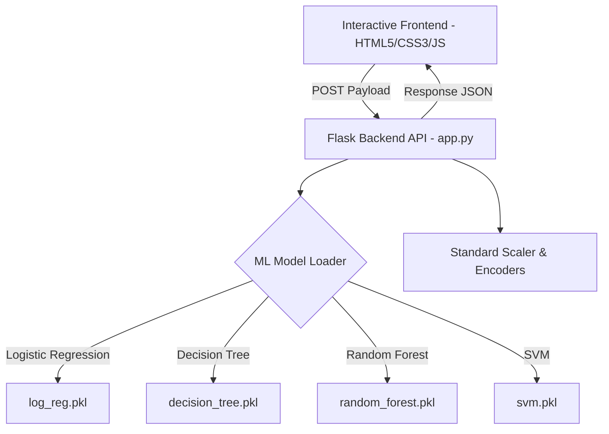

# churn.ai — Machine Learning Customer Churn Predictor

An advanced, state-of-the-art customer churn prediction dashboard powered by multiple machine learning models. Built to evaluate customer data in real time, analyze risk factors, and provide tailored proactive outreach recommendations.

### 🔗 [Live Production Demo on Render](https://customer-churn-prediction-63kd.onrender.com)

---

## 🌟 Key Features

* **Advanced Professional Dashboard**: Fully styled with an elegant, modern warm-sand color palette (`#FAF9F6`), high-end typography (`Playfair Display` & `Plus Jakarta Sans`), and custom organic fluid wave gradients.
* **Responsive Layout Alignment**: An interactive tab-based navigation system (`Personal Profile`, `Phone Services`, `Internet Services`, `Billing & Payments`) that guarantees flawless grid alignment and prevents uneven elements.
* **Aggregate Risk Scoring**: Displays a live, animated circular SVG risk ring that aggregates predictions across all models to calculate a unified customer churn risk percentage.
* **Proactive Retention Strategies**: Automatically recommends tailored marketing or customer success steps based on the calculated risk tier (Low, Moderate, High Risk).
* **Multi-Model Pipeline Comparison**: Seamlessly computes and compares predictions and confidence scores for four top-tier classification models simultaneously:
  * **❖ Logistic Regression**
  * **✦ Decision Tree**
  * **✹ Random Forest**
  * **💠 Support Vector Machine (SVM)**

---

## 🛠️ Architecture & Technical Stack



### **Frontend**
* **Core**: HTML5, Vanilla JavaScript (ES6+), and CSS3.
* **Styling & Aesthetics**: High-contrast modern card views, dynamic hover highlights with premium gold accents (`#c69c3a`), responsive scrollable pill bars, and interactive selected card animations.

### **Backend**
* **Web Server**: Python (Flask) with Gunicorn WSGI for robust production deployment.
* **CORS**: Configured with `flask-cors` for secure cross-origin queries.

### **Machine Learning**
* **Framework**: `scikit-learn` for classification algorithms.
* **Data Processing**: Pre-trained standard scalers and categorical label encoders persisted via `joblib`.

---

## 📂 Project Directory Structure

```text
├── models/
│   ├── log_reg.pkl           # Trained Logistic Regression model
│   ├── decision_tree.pkl     # Trained Decision Tree classifier
│   ├── random_forest.pkl     # Trained Random Forest classifier
│   ├── svm.pkl               # Trained Support Vector Machine model
│   ├── scaler.pkl            # StandardScaler instance for input normalization
│   └── encoders.pkl          # Persisted label encoders for categorical values
├── static/
│   └── index.html            # Redesigned premium frontend dashboard
├── app.py                    # Flask server & model inference routes
├── requirements.txt          # Python dependencies
├── Procfile                  # Startup configuration for cloud platforms
└── README.md                 # Project documentation
```

---

## 💻 Local Setup & Development

### **Prerequisites**
Make sure you have **Python 3.8+** installed on your machine.

### **1. Clone the Repository**
```bash
git clone https://github.com/dinesh9997/Customer-Churn-Prediction.git
cd Customer-Churn-Prediction
```

### **2. Create and Activate Virtual Environment**
```bash
# On Windows
python -m venv venv
venv\Scripts\activate

# On macOS/Linux
python3 -m venv venv
source venv/bin/activate
```

### **3. Install Dependencies**
```bash
pip install -r requirements.txt
```

### **4. Start the Application**
```bash
python app.py
```

### **5. View in Browser**
Open your browser and navigate to:
👉 **[http://localhost:5000/](http://localhost:5000/)**

---

## 🚀 Production Deployment on Render

This project is configured for **1-click deployments** on [Render](https://render.com).

### **Render Settings**
* **Runtime**: `Python 3`
* **Build Command**: `pip install -r requirements.txt`
* **Start Command**: `gunicorn app:app`
* **Instance Type**: `Free`

---

## 📜 License
This project is licensed under the MIT License - see the LICENSE file for details.

## 👥 Authors
* **Dinesh** — *Initial Work & Model Engineering* (GitHub: [@dinesh9997](https://github.com/dinesh9997))
